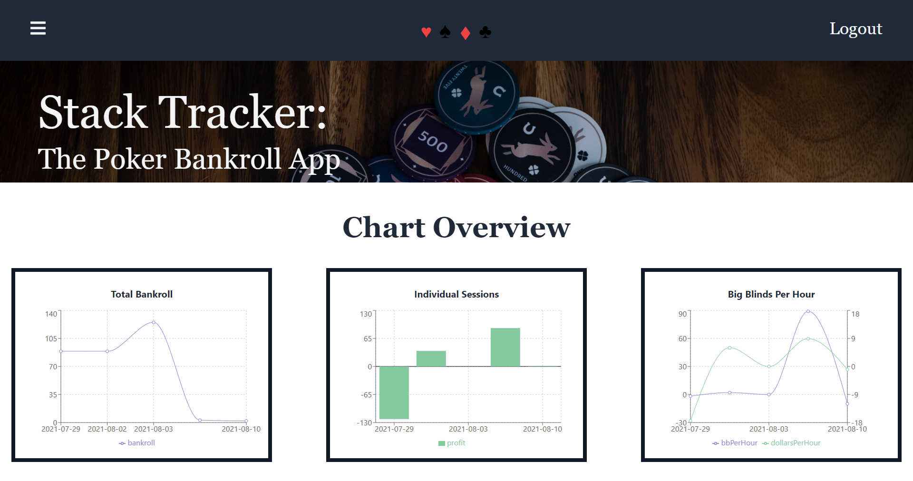

# Stack Tracker: The Poker Bankroll App

## Deployed at: (https://sleepy-thicket-12395.herokuapp.com/)
## Description
Stack Tracker is to quickly and easily record all of your poker sessions. You are able to view tables of all of your session's data as well as view your sessions by location. It also provides you with your overall bankroll, average cash per hour, and average big blinds per hour. You can also view your bankroll, average cash per hour, and average big blind per hour at a specific location. You can also see visual representations of your bankroll, session results, and cash per hour/big blind per hour in various charts and graphs. Adding a session to your data is as simple as filling out a short form. 
## Table of Contents
  * [Installation](#Installation)
  * [Usage](#Usage)
  * [Screenshots](#Screenshots)
  * [License](#License)
  * [Contact](#Questions)
## Installation
To install this application on your local machine. Simply clone the code base to your computer, navigate to the root directory of the application, and run the command `npm i` to install all of the necessary dependencies.
## Usage
First, you need to either login or signup. Simply fill in the necessary information into the inputs on the landing page. You will need an username, email, and password to sign up and just your username and password to login as an existing user. From there, you will be redirected to the dashboard page. There you have access to all of your sessions, your sessions by location, your metrics presented in charts, and a form for adding a session. To navigate to any of the pages, click on the corresponding link in the sidebar or bring down the menu in the top of the screen by either tapping or hovering over the menu icon. To add session navigate to the add session page and fill out the form with all of the fields.
## Screenshots

## License
MIT License

Copyright (c) 2021, Allan Pirillis, Danny Cheever, Shay Wagner, Vasily Giannakopoulos

Permission is hereby granted, free of charge, to any person obtaining a copy
of this software and associated documentation files (the "Software"), to deal
in the Software without restriction, including without limitation the rights
to use, copy, modify, merge, publish, distribute, sublicense, and/or sell
copies of the Software, and to permit persons to whom the Software is
furnished to do so, subject to the following conditions:

The above copyright notice and this permission notice shall be included in all
copies or substantial portions of the Software.

THE SOFTWARE IS PROVIDED "AS IS", WITHOUT WARRANTY OF ANY KIND, EXPRESS OR
IMPLIED, INCLUDING BUT NOT LIMITED TO THE WARRANTIES OF MERCHANTABILITY,
FITNESS FOR A PARTICULAR PURPOSE AND NONINFRINGEMENT. IN NO EVENT SHALL THE
AUTHORS OR COPYRIGHT HOLDERS BE LIABLE FOR ANY CLAIM, DAMAGES OR OTHER
LIABILITY, WHETHER IN AN ACTION OF CONTRACT, TORT OR OTHERWISE, ARISING FROM,
OUT OF OR IN CONNECTION WITH THE SOFTWARE OR THE USE OR OTHER DEALINGS IN THE
SOFTWARE.
## Questions
GitHub: allanp94, dceever88, srwagner916, vasilyg10 
Email: <allan.p94@gmail.com>, <cheeverdanny@gmail.com>, <srwagner916@gmail.com>, <zvgianna@gmail.com>
